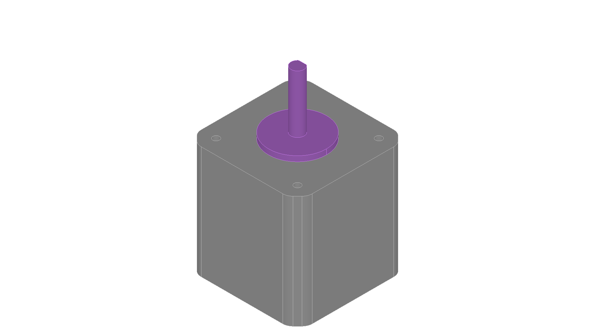
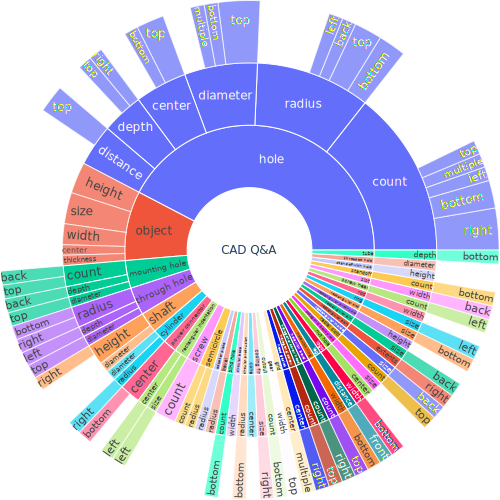

# QueryCAD: Grounded Question Answering for CAD Models



Official implementation for reproducing the results from the paper **"QueryCAD: Grounded Question Answering for CAD Models"**.
Website to the paper: https://claudius-kienle.github.io/papers/p/querycad.html

## Installation

**1. Install pixi**  
Follow the instructions at https://pixi.sh

**2. Setup environment**
```sh
pixi install
```

**3. Download model checkpoints and datasets**
```sh
git lfs pull  # requires git-lfs to be installed
cd resources/cad-models
unzip dataset.zip
cd ../..
```

**4. Configure OpenAI API**  
Create a `.env` file in the project root:
```bash
OPENAPI_API_KEY=<YOUR_API_KEY>
```

## Reproducing Benchmark Results

**1. Start GroundedSAM service**  
Launches the image segmentation service required for part identification:
```sh
cd docs/lang-segment-anything
pixi run sam
```
Keep this terminal running.

**2. Run inference**  
In a new terminal, execute the benchmark on the dataset:
```sh
pixi shell
python scripts/benchmark/02-infer-ds.py
```

This script:
- Loads CAD models from `resources/cad-models`
- Processes queries using the LLM-based CAD expert interface
- Applies image-based segmentation to ground answers
- Saves results to `resources/eval`

**3. Evaluate results**  
Use the provided notebooks to analyze performance:
- `scripts/benchmark/03-eval-results.ipynb` - Compute metrics

## Additional Scripts

- `scripts/benchmark/01-gen-abc-ds.ipynb` - Generate processed dataset from raw STEP files
- `scripts/benchmark/run-dataset.sh` - Batch processing script for multiple datasets

## Details about the Benchmark

This is a benchmark for CAD question answering. 

It consists of 18 CAD models, 10 of which are derived from the ABC dataset, located at [./resources/cad-models/abc](./resources/cad-models/abc), and 8 CAD models stem from real-world industrial settings, located at [./resources/cad-models/industrial](./resources/cad-models/industrial).

For each CAD model, we generated between 4 and 10 questions stored in a file `input.txt`. They are designed to retrieve specific properties, such as measurements, positions, or counts of particular parts. Each question targets either a specific type of part or the entire CAD model, inquiring about a particular property while sometimes restricting the valid parts by specifying a side the parts should be visible on or applying other filtering criteria based on the part's characteristics. The distribution and structure of these questions are illustrated in following Figure:


To address open-set segmentation, the questions cover a total of 43 diverse parts and ask about 11 different properties.

To define the label for each question, we manually measured the CAD models using a CAD kernel and calculated the responses by hand, saved in a `solution.txt` file.

Sometimes, there are multiple correct answers to a question. In such cases, `solution.txt` contains a regular expression (prefixed with `re`) the answer must respect. Also, if the answer is a unsorted list, we sort it before comparison, toggled via the `sorted` keyword in `metadata.txt`.


## Citation

If you use this code in your research, please cite:

```bibtex
@inproceedings{kienle2025querycad,
  title={QueryCAD: Grounded question answering for CAD models},
  author={Kienle, Claudius and Alt, Benjamin and Katic, Darko and J{\"a}kel, Rainer and Peters, Jan},
  booktitle={2025 IEEE International Conference on Robotics and Automation (ICRA)},
  pages={5798--5805},
  year={2025},
  organization={IEEE}
}
```
